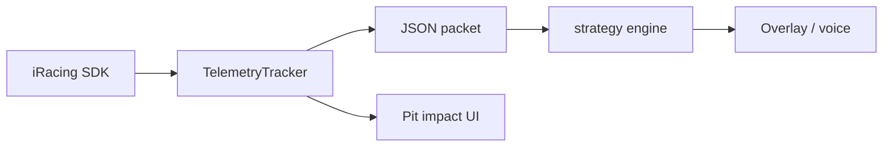

# Calculation reference

This document explains how **AI Race Engineer** turns iRacing telemetry into fuel estimates, pit-impact projections, strategy calls, and pre-race plans. All logic is **deterministic** (no cloud AI).

Primary source files:

| Area | Module |
|------|--------|
| Telemetry ingestion & packet | `telemetry.py` |
| Live calls & forecast | `strategy_engine.py` |
| Garage / pre-race plan | `pre_race_strategy.py` |
| Track pit-loss default | `ui.py` |
| Receiver LAN snapshots | `remote_telemetry.py`, `race_memory.py` |

---

## Data flow (high level)



1. **Poll** (~250 ms): read SDK vars, update bounded lap history and fuel EMA.
2. **Build packet**: compact JSON (`m` = you, `s` = session, `r` = race inputs, `fi` = field intel).
3. **Strategy engine**: immediate pit/stay-out call + optional green-flag stop forecast.
4. **UI**: display advice, pit-impact line, auto alerts, voice relay.

User-adjustable inputs that feed calculations:

- **Pit loss (sec)** — time lost vs staying out (default from track length; see below).
- **Tire sets remaining** — affects whether stops are `4 TIRES` vs `FUEL ONLY`. Auto-syncs from SDK (`TireSetsAvailable` in race; `PlayerCarDryTireSetLimit` in practice/qualifying when the series caps sets).

---

## 1. Lap pace history

**Goal:** Recent pace for you and key rivals without unbounded memory.

**Who is tracked** (`_tracked_indices`):

- Your car
- Class positions **P1–P3**
- Anyone within **±2** positions of you

**Per car:** keep last **`LAP_HISTORY_DEPTH` (5)** completed lap times in a ring buffer. A lap is recorded only when `CarIdxLap` increments and `CarIdxLastLapTime > 0`.

**Pace stats** (`pace_stats`):

```
avg_last3_s = mean(last 3 lap times)
avg_last5_s = mean(last 5 lap times)
trend_s     = avg_last3_s − avg_last5_s   # positive = slowing
```

**Average lap for a car** (`_avg_lap_s_for_idx`):

```
avg = mean(last up to 3 laps)   # fallback 90.0 s if no history
```

---

## 2. Fuel burn & laps remaining

Internal math uses **liters** and **kg/h** from the SDK. The packet exposes US gallons for display/strategy.

### 2.1 Lap-boundary EMA (preferred)

On each lap boundary (`Lap` increases):

```
sample_L_per_lap = (fuel_at_prev_lap − fuel_now) / (lap_delta)
```

Sample is accepted only if:

- `lap_delta ≥ 1`
- burn `> 0.02` L
- burn `≤ 98%` of tank capacity (rejects bad refuels / noise)

EMA update (`FUEL_EMA_ALPHA = 0.45`):

```
fuel_per_lap_ema = FUEL_EMA_ALPHA × sample + (1 − FUEL_EMA_ALPHA) × previous_ema
```

Lap counter going **backward** (session reset) clears the EMA.

**After pit exit** (transition `OnPitRoad: true → false`): if `FuelLevel ≥ 88%` of tank capacity, clear the lap EMA and lap-boundary trackers so the first flying laps after a fill-up are not skewed by pit-road burn.

### 2.2 Instantaneous estimate (fallback)

`FuelUsePerHour` is **kg/h**. Convert to L/h using **`GASOLINE_KG_PER_L` (0.73 kg/L)** — Sunoco Green E15 nominal density:

```
fuel_L_per_h = FuelUsePerHour_kg_h / GASOLINE_KG_PER_L
fuel_L_per_lap_inst = fuel_L_per_h × (avg_lap_s / 3600)
```

### 2.3 Combined burn rate

Under **caution/yellow**, bypass the EMA and use instantaneous burn only (fuel-saving pace), floored at **`DEFAULT_CAUTION_BURN_L` (0.20 L/lap)**:

```
fuel_use_per_lap_est = resolve_combined_burn_rate(kg_h, avg_lap_s, ema_L, is_caution=True)
```

Under **green-flag** racing:

```
fuel_use_per_lap_est = resolve_combined_burn_rate(kg_h, avg_lap_s, ema_L, is_caution=False)
                     = max(fuel_L_per_lap_inst, fuel_per_lap_ema)
```

`r.ftl` (full-tank stint) always uses the **saved green-flag EMA** when available, not the caution-instant rate.

### 2.4 Laps of fuel left

```
laps_of_fuel_left = FuelLevel_L / fuel_use_per_lap_est
```

**Sanity clamp** (when `SessionLapsRemain` is a verified integer): if

```
laps_of_fuel_left > laps_remain × FUEL_LAPS_CLAMP_MULTIPLIER   (2×)
OR
laps_of_fuel_left > laps_remain + FUEL_LAPS_CLAMP_OFFSET        (+30)
```

then force-correct burn upward:

```
fuel_use_per_lap_est = max(fuel_use_per_lap_est, fuel_level / laps_remain)
laps_of_fuel_left    = fuel_level / fuel_use_per_lap_est
```

### 2.5 Fuel estimate quality (`fcq`)

| Quality | Condition |
|---------|-----------|
| `hi` | EMA exists and current lap ≥ 3 |
| `low` | On pit road and no EMA yet |
| `med` | Otherwise |

Packet flag `x.fe = 1` only when estimates pass plausibility checks (reasonable gal/lap, laps left &lt; 420, on-track data, etc.). If `fe = 0`, fuel-dependent fields are stripped from the packet.

### 2.6 Full-tank stint length (`r.ftl`)

```
ftl = FuelCapacity_L / fuel_use_per_lap_est
```

Discarded if `ftl < 0.8` or `ftl > 320` laps.

### 2.7 Make it to the end

```
can_make_to_end = (laps_of_fuel_left ≥ SessionLapsRemain)
laps_short      = max(0, SessionLapsRemain − laps_of_fuel_left)
```

### 2.8 Unit conversion (packet only)

```
US_gal = liters × 0.2641720523581484
lb/h   = kg/h × 2.204622621847693185
```

---

## 3. Tire stint & degradation

### 3.1 Stint length

`sl` = laps since last **exit** from pit road (transition `OnPitRoad: true → false` resets stint).

`lp` = lap number recorded at that exit (`last_pit_lap`). Strategy helpers also derive stint length as `Lap − lp` when `sl` is absent.

### 3.2 Tire wear snapshot

Corner wear = average of L/M/R tread (`LFwearL`, etc.) or `PitSv*Toffset` in the stall.

Wear is often only fresh in the pit box; off-track the packet uses **last known** wear (`tws` = stale flag).

### 3.3 Wear rate estimate

If last-known wear exists over `twsl` stint laps:

```
twr[corner] = wear_value / twsl
```

### 3.4 Pace falloff (`m.fo`)

```
falloff_s = avg_last3_s − best_lap_in_history
```

Positive = slower than your best recent lap (tire/conditions degradation proxy).

### 3.5 Pit payback laps (`m.pb`)

Triangular cumulative wear model (aligned with Section 12.3), implemented as `triangular_payback_lap()` in `race_constants.py`:

```
For lap = 1, 2, 3, …:
    cumulative += lap × falloff_s
    if cumulative >= pit_loss_sec:
        pit_payback_laps = lap
```

`falloff_s` = `m.fo` (avg_last3 − best lap). Strategy engine falls back to the same function via `_resolve_pit_payback_laps()` when `m.pb` is absent.

---

## 4. Pit window helpers

Telemetry exposes two related flags:

```
can_make_to_end (mk) = (laps_of_fuel_left ≥ SessionLapsRemain)
pit_window_open   (pw) = can_make_to_end    # same value in packet; informational
laps_until_window (pwu) = max(0, laps_remain − laps_of_fuel_left)
```

**Important:** `mk = true` means you have **enough fuel to finish the race** — it does **not** by itself mean “pit now.”

The strategy engine’s **`inside_window`** (trusted fuel) is:

```
inside_window = (mk is false)           # cannot make it to the end on fuel → must plan a stop
             OR (fuel_laps_left ≤ pb)   # within tire payback range (m.pb)
```

Untrusted fuel (`x.fe = 0` or `fcq` low): `inside_window = fuel_laps_left ≤ 2`.

---

## 5. Gap estimates

**Between two car indices** (`_gap_est_s`):

1. Prefer `CarIdxF2Time` difference if both ≥ 0.
2. Else use lap distance percent with start/finish wrap (`wrap_lap_distance_delta()`):

```
delta = dist_b − dist_a
if delta > LAP_DIST_WRAP_HALF (0.5):  delta -= 1.0
if delta < −LAP_DIST_WRAP_HALF:       delta += 1.0
gap_s = |delta| × lap_s_fallback
```

Used for `m.ga` / `m.gb` (gap ahead/behind) and green-flag pit-loss simulation.

---

## 6. Field intel (`fi`)

Built each packet for tracked cars.

### 6.1 Herd counts (`fi.hd`) — `HERD_POSITION_WINDOW` (±5 positions)

| Key | Meaning |
|-----|---------|
| `apa` | Cars ahead on **approaching pits** surface |
| `isa` | Cars ahead **in stall** |
| `apb` / `isb` | Same behind you |

### 6.2 Pitting ratios under caution (`pra`, `prb`)

Within ±`HERD_POSITION_WINDOW` class positions:

```
pra = (ahead cars pitting) / (ahead cars total)
prb = (behind cars pitting) / (behind cars total)
```

“Pitting” = `CarIdxOnPitRoad` or surface in `{approaching pits, in stall}`.

### 6.3 Reentry traffic (`fi.rej`)

Projects where on track you merge after a pit:

```
pit_frac     = (pit_loss_sec / avg_lap_s) mod 1.0
reentry_dist = (your_lap_dist_pct + pit_frac) mod 1.0
```

Count on-track cars whose `LapDistPct` is within **`REENTRY_WINDOW_PCT` (±3.5%)** of `reentry_dist`:

| Cars in window | Verdict |
|----------------|---------|
| 0 | `CLEAN` |
| 1 | `TRAFFIC` |
| ≥ 2 | `PACK` |

Live strategy **delays** a pit when window is open but verdict is `PACK`.

### 6.4 Caution pit intel (`fi.cpi`)

See [Section 7](#7-caution-pit-impact). Compact keys: `ll` lead-lap loss, `tl` total class loss, `xp` exit class position, `gr` restart grid rows, `lda` lap-down traffic count.

---

## 7. Caution pit impact

Used for yellow-flag strategy and the **pit-impact** overlay line.

### 7.1 Lead-lap universe

```
leader_lap = max(CarIdxLap) over field
lead_positions = class positions of all cars on leader_lap (including you if on lead lap)
player_rank_lead = index of your position in sorted lead_positions + 1
```

### 7.2 Who is modeled

- **Lead-lap ahead** — on leader lap, position &lt; yours
- **Lap-down ahead** — laps &lt; leader, position &lt; yours (stay-out traffic)
- **Behind stay-out** — position &gt; yours, not pitting

### 7.3 Herd-adjusted pitting

From `hd.pra` / `hd.prb` (defaults 0.35 / 0.25 if missing):

```
stay_out_lead_ahead ≈ max(actual, round(lead_ahead_count × (1 − pra)))
pitting_lead_ahead  ≈ max(actual, round(lead_ahead_count × pra))
```

### 7.4 Exit rank & losses

```
exit_rank_lead = min(lead_field_size, stay_out_lead_ahead + pitting_lead_ahead + 1)
lost_lead      = max(0, exit_rank_lead − player_rank_lead)
```

If pit is **N laps away**, add `min(2, N)` to `lost_lead`.

```
exit_class = min(field_size, player_pos + lost_lead + cars_behind_passing)
total_lost = max(0, exit_class − player_pos)
grid_rows  = round(lost_lead × 0.75)
lda        = lap-down cars likely still ahead on track after stop
```

**Caution strategy** uses `cpi.ll` (lead-lap spots) and `hd.pra`:

- **PIT** if `ll ≤ 3` OR `pra > 0.6` (field boxing)
- **STAY OUT** otherwise (unless fuel critical)
- **PIT NOW** if fuel ≤ 1 lap under yellow

---

## 8. Green-flag pit position loss

For each car **P+1 … P+5**:

```
projected_gap = gap_behind_now + pit_in_laps × (their_avg_lap − your_avg_lap)
```

If `projected_gap < pit_loss_sec`, you lose one more position:

```
lost = count of such cars
```

Receiver mode without full field sim uses a shortcut: if `gap_behind < pit_loss_sec` → `lost = 1`.

---

## 9. Default pit-road loss (UI)

Defined in `race_constants.py` as `get_default_pit_loss_seconds(track_name, track_length_miles)`.

When **Auto pit loss on connect** is on and you have not manually changed pit loss:

| Track type | Rule | Constant / value |
|------------|------|------------------|
| Super | Name contains Daytona/Talladega, or length ≥ `PIT_LOSS_SUPER_MIN_LENGTH_MI` (2.3 mi) | `PIT_LOSS_SUPER_SEC` = **58** |
| Short | Length ≤ `PIT_LOSS_SHORT_MAX_LENGTH_MI` (1.2 mi) | `PIT_LOSS_SHORT_SEC` = **42** |
| Intermediate | Otherwise | `PIT_LOSS_INTERMEDIATE_SEC` = **46** |

If SDK track length is missing, `resolve_track_length_miles()` supplies **1.5 mi** so unknown tracks default to intermediate (not short).

Track length is parsed from `TrackLength` (mi/km string or numeric heuristic) in `telemetry.py`.

---

## 10. Live strategy engine

Entry: `evaluate_and_forecast_strategy(telemetry)` in `strategy_engine.py`.

### 10.1 Fuel context

**Trusted** (`x.fe = 1` and `fcq ∈ {hi, med}`):

```
fuel_laps_left = m.fl
inside_window  = (m.mk is false) OR (fuel_laps_left ≤ m.pb)
fuel_critical  = fuel_laps_left ≤ 1
```

**Untrusted:**

```
fuel_laps_left = ful_liters / max(fpl, 0.2)
inside_window  = fuel_laps_left ≤ 2
fuel_critical  = fuel_laps_left ≤ 1
```

**Post-pit quiet** (`_post_pit_alert_quiet`): if stint laps since last pit exit are below:

```
min_stint_before_alert = max(POST_PIT_ALERT_MIN_STINT_LAPS, ftl − ALERT_LAP_HORIZON − 1)
```

(default `POST_PIT_ALERT_MIN_STINT_LAPS = 6`), suppress **PIT NOW** from an open window unless fuel is critical. Holds **STAY OUT** with reason “fresh stint after pit stop.”

### 10.2 Immediate decision (priority order)

| # | Condition | Action |
|---|-----------|--------|
| 1 | Pit lane closed (`flb.pcl`) | STAY OUT |
| 2 | On pit road / in stall | STAY OUT (REPAIR if `PitRepairLeft > 0`) |
| 3 | Yellow/caution | Caution rules ([§7](#7-caution-pit-impact), fuel critical) |
| 4 | Fuel critical | PIT NOW |
| 5 | Pit window open + reentry `CLEAN` + not in post-pit quiet | PIT NOW |
| 5b | Pit window open + reentry `CLEAN` + post-pit quiet | STAY OUT (fresh stint) |
| 6 | Pit window open + reentry `PACK` | STAY OUT (delay 1 lap) |
| 7 | Default | STAY OUT |

**Service** on pit calls:

```
4 TIRES   if tire_sets_remaining > 0
FUEL ONLY otherwise
```

### 10.3 Green-flag rest-of-race forecast

Skipped while yellow is active (`paused_for_caution`).

Simulation state after immediate call:

- If pitting now: next lap starts with full tank stint `max_tank_stint = max(1, ftl − 1)`
- If staying out: seed fuel via `_forecast_fuel_laps_seed()`:
  - **Laps 0–3 after pit exit:** `sim_fuel = max(max_tank_stint, green_fuel_laps) − 1` (full-tank stint, not stale pre-pit burn)
  - **Otherwise:** `sim_fuel = green_fuel_laps − 1` from green-flag EMA only (Section 2.3; not caution-inflated `m.fl`)

```
green_fuel_laps = fuel_liters / m.fpe_ema_L     # m.fpe in packet, converted to L/lap
```

Implemented as `green_flag_fuel_laps_from_telemetry()` in `race_constants.py`.

Each simulated lap:

```
if sim_fuel ≤ 1:
    schedule stop at sim_current_lap (4 TIRES if sets remain else FUEL ONLY)
    reset sim_fuel = max_tank_stint
sim_current_lap += 1
sim_laps_remaining −= 1
sim_fuel −= 1
```

Output: list of `{estimated_pit_lap, laps_from_now, service_required}`.

### 10.4 Trigger & confidence labels

Heuristic from WHY text and flags:

| Trigger | Typical CONF |
|---------|----------------|
| FLAGS | H |
| REPAIR | H |
| FUEL | H if PIT NOW, else M |
| TIRES | M |
| TRACK (traffic/pack) | M |

---

## 11. Auto pit alerts

Evaluated on the engineer PC when **Auto pit alerts** is on (`ui.py` → `_check_auto_strategy()`). Triggers on **lap change** or **caution state change** (receiver: once per LAN snapshot, not duplicated on the local poll timer).

Default horizon: **`ALERT_LAP_HORIZON` = 5** laps.

### 11.1 When `should_auto_alert()` returns true

1. **Caution just started** (`caution_started` and yellow/caution flags active) — always announce the engineer call (pit / stay out), even if the call line matches a prior alert.
2. **Explicit pit timing** — parsed call is `PIT` / `PIT NOW` with `laps_until_pit ≤ N`.
3. **Fuel pressure** — `fuel_laps_left ≤ N` and (pit call, `mk` is false, or `fuel ≤ pb + 1`). **Fuel critical** (`≤ 1` lap) always alerts even during post-pit quiet.
4. **Forecast stop** — projected stop with `laps_from_now ≤ N`, unless:
   - caution **just ended** (`caution_ended` — forecast resume alone does not alert), or
   - **post-pit quiet** (Section 10.1) is active.

### 11.2 Delivery deduplication

- **Call line** (first line: `ACTION — TIMING — SERVICE`) is the dedup key for voice and relay — not the full text (FORECAST changes every lap).
- Same call line on consecutive laps does not re-speak unless caution started.
- One caution announcement per yellow (`_auto_caution_announced` until green).
- Sim PC (`broadcaster_ui.py`) also dedupes TTS by call line.

### 11.3 Voice (sim PC)

TTS reads the **call line** and optional **WHY** only. **FORECAST** and **TRIGGER** lines are display-only (skipped by `speech.py`).

---

## 12. Pre-race green-flag plan

Entry: `run_pre_race_plan()` → `generate_pre_race_green_plan()`.

Used in **garage / off-track** mode (`ui_mode() == strategy`) — including when you are in **practice or qualifying** on a race server but want the **race** stint plan.

### 12.1 Race session resolution

`find_race_session()` scans embedded SessionInfo YAML (`packet.sy`) for the **Race** session, not the current session:

- `SessionType` case-insensitive `"race"`
- `SessionName` in `{RACE, MAIN RACE, FEATURE RACE, …}` (iRacing often uses uppercase `RACE`)
- Prefers the last non-skipped race session in the weekend list

Packet hints when YAML is slim:

- `s.race_lt` — race `SessionLaps` from YAML (never practice/qual lap count)
- `r.tsl` — race-weekend tire allocation (`PlayerCarDryTireSetLimit`)

Fallback synthesis (`session_yaml_from_telemetry`) uses `s.race_lt`, not `s.lt`, unless the current session is already the race.

### 12.2 Tire set limit (pre-race rules)

`race_tire_set_limit()` priority:

1. `r.tsl` / `r.ts_limit` in packet (`PlayerCarDryTireSetLimit`)
2. `WeekendInfo.WeekendOptions` tire keys
3. Race session YAML tire keys
4. `r.ts` remaining sets **only** when current session is race
5. Default **2**

SDK value **255** = unlimited (`IRSDK_TIRE_SETS_UNLIMITED`) → keep manual UI value.

### 12.3 Baseline from telemetry

| Input | Source |
|-------|--------|
| `avg_lap_time_s` | Mean of your lap history, else best lap, else rival pace avg |
| `fuel_burn_per_lap_gal` | `fpe` or `fpl`, else `fc / ftl` |
| `tire_wear_pace_falloff_per_lap_s` | `m.fo` or default **0.08** s/lap |
| `pit_lane_loss_time_s` | User `r.pl` (default 45) |
| `fuel_tank_capacity_gal` | `r.fc` |

### 12.4 Race length

From SessionInfo YAML **race** session (`find_race_session`):

- Use `SessionLaps` if valid (integer &lt; 32000; string `"unlimited"` rejected)
- Else scheduled `SessionTime` ÷ `avg_lap_time_s` (not current-session `SessionLapsTotal`)

### 12.5 Stint caps

```
fuel_stint_cap = floor(max_capacity / fuel_burn) − 1

tire_stint_cap: smallest lap L where sum_{i=1..L}(i × tire_falloff) > pit_loss + TIRE_COST_THRESHOLD_BUMP
                (cumulative triangular wear cost)

stint_length = min(fuel_stint_cap, tire_stint_cap)
```

### 12.6 Stop count & schedule

```
total_stops = floor(total_laps / stint_length)
if total_laps % stint_length == 0 and total_stops > 0:
    total_stops -= 1   # exact fit → one fewer stop

Pit on laps: stint_length, 2×stint_length, … 
Service BOTH if fuel-limited stint or tire sets allow; else FUEL ONLY or 4 TIRES
```

NOTE: ~{total} race laps at {track}; plan assumes green-flag run — adjust for cautions

Formatted output lines: FUEL / TIRES / STOPS / NOTE / TRIGGER.

---

## 13. Receiver (engineer PC) differences

- Telemetry arrives as **LAN snapshots** (~250 ms); `RemoteTelemetry` overlays your pit loss and tire sets on the cached packet.
- Auto alerts run on snapshot ingest only (not also on the local telemetry poll) to avoid duplicate triggers.
- **Caution pit impact** reuses broadcaster-computed `fi.cpi` when present.
- **Green-flag loss** uses gap-behind shortcut when full field projection is unavailable.
- `RaceMemory` rolls snapshots into lap rollups, caution/pit events, and trend features (`packet.h`) — does not change core strategy formulas above.
- Voice is relayed to the sim PC when **Speak on sim PC** is on; engineer PC does not speak locally while linked.

---

## 14. Constants quick reference

All alignment scalars live in **`race_constants.py`** (GridNotes v1.0.x — Section 14):

| Parameter | Constant | Value | Used in |
|-----------|----------|-------|---------|
| Sunoco E15 density | `GASOLINE_KG_PER_L` | 0.73 kg/L | `race_constants.py` |
| Zero-flow safeguard | `MIN_FUEL_USE_KG_PER_H` | 0.05 kg/h | `race_constants.py` |
| Caution burn floor | `DEFAULT_CAUTION_BURN_L` | 0.20 L/lap | `race_constants.py` |
| S/F wrap divider | `LAP_DIST_WRAP_HALF` | 0.5 | `race_constants.py` |
| Fuel EMA α | `FUEL_EMA_ALPHA` | 0.45 | `telemetry.py` |
| Pace history ring buffer | `LAP_HISTORY_DEPTH` | 5 | `telemetry.py` |
| Default lap fallback | `DEFAULT_AVG_LAP_S` | 90.0 s | `telemetry.py` |
| Min lap time clamp | `MIN_AVG_LAP_S` | 1.0 s | `race_constants.py` |
| Reentry traffic window | `REENTRY_WINDOW_PCT` | 0.035 (3.5%) | `telemetry.py` |
| Herd tracking window | `HERD_POSITION_WINDOW` | ±5 positions | `telemetry.py` |
| Auto alert horizon | `ALERT_LAP_HORIZON` | 5 laps | `strategy_engine.py`, `ui.py` |
| Post-pit alert quiet min | `POST_PIT_ALERT_MIN_STINT_LAPS` | 6 laps | `race_constants.py`, `strategy_engine.py` |
| Unlimited tire sets sentinel | `IRSDK_TIRE_SETS_UNLIMITED` | 255 | `race_constants.py`, `telemetry.py` |
| Pre-race tire cost buffer | `TIRE_COST_THRESHOLD_BUMP` | 30.0 s | `pre_race_strategy.py` |
| Fuel laps clamp multiplier | `FUEL_LAPS_CLAMP_MULTIPLIER` | 2.0 | `telemetry.py` |
| Fuel laps clamp offset | `FUEL_LAPS_CLAMP_OFFSET` | 30.0 laps | `telemetry.py` |
| Super pit loss | `PIT_LOSS_SUPER_SEC` | 58.0 s | `race_constants.py` → `ui.py` |
| Short pit loss | `PIT_LOSS_SHORT_SEC` | 42.0 s | `race_constants.py` → `ui.py` |
| Intermediate pit loss | `PIT_LOSS_INTERMEDIATE_SEC` | 46.0 s | `race_constants.py` → `ui.py` |

Other module-local values:

| Constant | Value | Where |
|----------|-------|--------|
| Caution pit delay bump | max 2 laps | `telemetry.py` |
| Request watchdog | 30 s | `ui.py` |

Shared helpers in `race_constants.py`: `clamp_fuel_use_kg_h()`, `clamp_nonneg_liters()`, `clamp_avg_lap_seconds()`, `clamp_lap_distance_pct()`, `resolve_combined_burn_rate()`, `green_flag_fuel_laps_from_telemetry()`, `triangular_payback_lap()`, `wrap_lap_distance_delta()`, `cumulative_triangular_wear_cost()`.

Pre-race helpers in `pre_race_strategy.py`: `find_race_session()`, `race_lap_total_from_yaml()`, `race_tire_set_limit()`.

Strategy helpers in `strategy_engine.py`: `_laps_since_pit_stop()`, `_post_pit_alert_quiet()`, `_forecast_fuel_laps_seed()`, `advice_call_line()`.

---

## 15. Output format (engineer call)

**Live mode** (4 lines):

```
ACTION — THIS LAP — SERVICE
WHY: ...
FORECAST: ...   (or "Paused under caution")   # display only; not spoken
TRIGGER: FUEL|FLAGS|...  CONF: H|M|L           # display only; not spoken
```

Voice reads line 1 and optionally line 2 (WHY). Engineer call dashes are normalized for speech (e.g. `PIT — THIS LAP — 4 TIRES` → “Pit. This lap. Four tires.”).

**Garage / strategy mode** (5 lines):

```
FUEL: ~X laps/tank · Y-lap stints
TIRES: ~X laps/set · N planned stop(s)
STOPS: L27 BOTH; L54 BOTH; ...
NOTE: ~L race laps at Track; green-flag assumption
TRIGGER: FUEL|TIRES  CONF: M
```

---

*This file describes behavior as implemented in the repository. iRacing SDK availability varies by car/session; when data is missing, documented fallbacks apply.*
