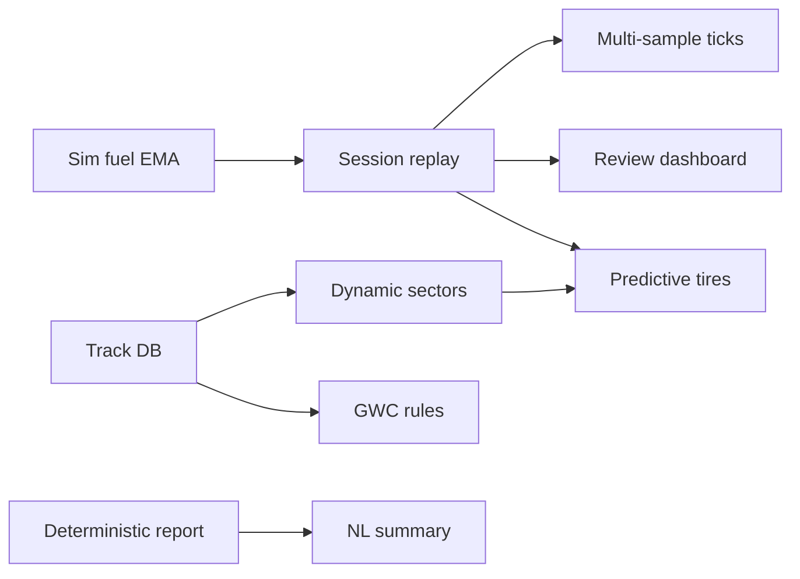

# Roadmap

Expansion plan for AI Race Engineer — prioritized by impact, feasibility, and dependencies. See [FEATURES.md](FEATURES.md) for what exists today and [CALCULATIONS.md](CALCULATIONS.md) / [SIMULATIONS.md](SIMULATIONS.md) for implementation detail.

---

## Status legend

| Symbol | Meaning |
|--------|---------|
| ✅ | Done |
| 🚧 | In progress |
| ⬜ | Planned |

---

## Phase A — Simulator parity (sim trust)

Closes the largest gap between offline regression and live iRacing behavior. **No changes to live strategy rules.**

| # | Feature | Status | Module(s) |
|---|---------|--------|-----------|
| A1 | **Simulated fuel EMA** — mock `m.ful` / `m.fpe` / yellow-lift purge in sim | ✅ | `sim/fuel_ema.py`, `sim/race_simulator.py` |
| A2 | **Session replay parser (MVP)** — record lap packets; CLI replay through production engine | ✅ | `engineer/session_recorder.py`, `scripts/replay_session.py` |
| A3 | **Multi-sample corner ticks** — sub-lap context polls for `m.drv.ss`, `fi.tac.db` | ✅ | `sim/race_simulator.py` |

**Exit criteria:** Sim green-flag box/forecast uses `green_flag_fuel_laps_from_telemetry()` like live; replay script runs saved sessions; tactical scenarios exercise high-rate context paths.

---

## Phase B — Live accuracy (pre-race + first-lap quality)

| # | Feature | Status | Module(s) |
|---|---------|--------|-----------|
| B1 | **Track configuration database** — SQLite/JSON cache: pit lane length, speed limit, measured pit loss | ✅ | `engineer/track_db.py`, `race_constants.py` |
| B2 | **Dynamic sector mapping** — peak `\|LatAccel\|` vs `LapDistPct` during practice; persist per track | ✅ | `engineer/telemetry.py`, `engineer/context_engine.py` |

**Exit criteria:** Unknown tracks get better default pit loss than the 46s intermediate heuristic; context corner sampling adapts per track after practice laps.

---

## Phase C — Strategy depth (series-specific)

| # | Feature | Status | Module(s) |
|---|---------|--------|-----------|
| C1 | **GWC / overtime fuel reserve** — +1 lap fuel critical threshold on ovals when `SessionLapsRemain` is low | ✅ | `engineer/strategy_engine.py` |
| C2 | **Oval tire stagger tracking** — left/right wear split (if SDK exposes usable signals) | ✅ | `engineer/telemetry.py`, `engineer/tire_model.py` |
| C3 | **Continuous predictive tire model** — combine `s.tt`, lateral load, `m.drv.ss` into tread estimate | ✅ | `engineer/tire_model.py`, `strategy_engine.py` |

**Dependencies:** C3 validated against Phase A replay; C2 requires SDK field audit first.

---

## Phase D — UX & post-race analytics

| # | Feature | Status | Module(s) |
|---|---------|--------|-----------|
| D1 | **Strategy review dashboard** — timeline of BASE PLAN vs LIVE CALLS, mode/ODI/thermal shifts | ✅ | `engineer/review_dashboard.py`, `engineer/ui.py` |
| D2 | **Deterministic post-race report** — positions gained/lost at pit windows, stint σ, fuel delta vs plan | ✅ | `engineer/session_report.py`, `scripts/post_race_report.py` |
| D3 | **Optional NL executive summary** — LLM layer on exported JSON only; cockpit engine unchanged | ✅ | Template summary in `session_report.py`; optional `--llm` later |

---

## Dependency graph

---

## Architectural guardrails

1. **Single strategy path** — replay and sim call `resolve_live_advice()` / `evaluate_auto_alert_tick()`; never duplicate rules in the simulator.
2. **Deterministic core, analytical shell** — post-race NL belongs outside `strategy_engine.py`.
3. **Graceful degradation** — track DB and sector maps fall back to current heuristics when data is missing.

---

## Gap reference (validated against codebase)

| Gap | Was | Now (Phase A) |
|-----|-----|---------------|
| Sim fuel forecast | `floor(m.fl)` when no `m.fpe` | ✅ `sim/fuel_ema.py` injects EMA fields |
| Session replay | Single-packet save only | ✅ JSONL recorder + `scripts/replay_session.py` |
| Context sampling | One poll/lap | ✅ Three sub-lap polls per green lap |
| Track pit loss | Short / intermediate / superspeedway heuristic | ✅ SQLite cache + seeds + measured pit stops |
| Dynamic sectors | Static `LapDistPct` 0.33–0.55 | ✅ Practice learning → per-track DB |
| GWC | White-flag coast only (`WHITE_FLAG_LAPS_REMAINING = 1`) | Extra-lap fuel reserve for overtime |
| Tire wear | `m.fo` median pace falloff proxy | Optional predictive thermal/load model |

---

## Suggested implementation order

1. ~~Phase A (all three items)~~ — **done**
2. ~~Phase B1 → B2~~ — **done**
3. ~~Phase C1 → C2 (SDK audit) → C3~~ — **done**
4. ~~Phase D2 → D1 → D3~~ — **done**
